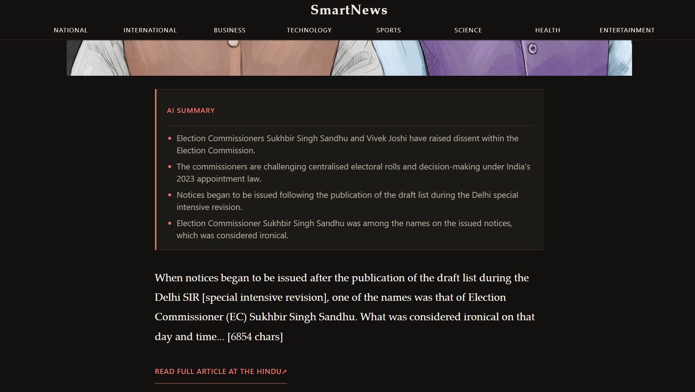
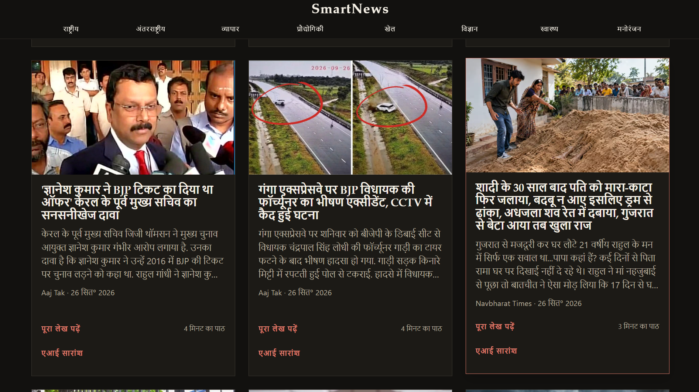

```markdown
# SmartNews

A React-based multi-source news aggregator with AI-powered article summarization. Browse and search news across multiple categories and countries, in 10 languages including English and 9 Indian languages, and get a concise AI-generated summary of any article without leaving the app.

**Live Demo:** https://smartnews-web.vercel.app/

## Screenshots

<h3 align="center">Homepage</h3>

<p align="center">
  
</p>

<h3 align="center">Category Page</h3>

<p align="center">
  
</p>

<h3 align="center">AI Article Summary</h3>

<p align="center">
  
</p>

<h3 align="center">Multilingual Support</h3>

<p align="center">
  
</p>

## Features

- **Multi-source news aggregation** via the GNews API — browse news by category or search for any topic
- **AI article summaries** powered by Google's Gemini API — get a concise 4–6 point summary without opening the original article
- **Multilingual support** — browse news and generate summaries in English, Hindi, Bengali, Gujarati, Kannada, Malayalam, Marathi, Punjabi, Tamil, and Telugu
- **Category-based browsing** — explore National, International, Business, Technology, Sports, Science, Health, and Entertainment news
- **Article pages** — view article details, AI summaries, and links to the original publisher
- **Search** — search headlines and topics across available news
- **Country selection** — switch the news feed's country focus
- **Light/dark theme** with persisted preference
- **Summary caching** — summaries are cached per article and language in localStorage to avoid unnecessary regeneration
- **Responsive design** — optimized for desktop and smaller screens
- **No login or database required** — preferences and cached summaries persist locally in the browser

## Tech Stack

| Layer | Technology |
|---|---|
| Frontend | React, React Router, Vite, plain CSS |
| Backend | Vercel Serverless Functions |
| News Data | GNews API |
| AI Summaries | Google Gemini API |
| Persistence | Browser localStorage |
| Deployment | Vercel + GitHub |

## Architecture

```text
                         USER
                           |
                           v
                  +-----------------+
                  | React Frontend  |
                  +--------+--------+
                           |
             +-------------+-------------+
             |                           |
             v                           v
        /api/news                  /api/summarize
             |                           |
             v                           v
         GNews API                  Gemini API
             |                           |
             v                           v
       News articles                AI summary
             |                           |
             +-------------+-------------+
                           v
                      React UI
```

Both external API keys (`GNEWS_API_KEY` and `GEMINI_API_KEY`) are kept server-side inside the Vercel serverless functions. The browser does not access these keys directly; requests from the React frontend go through `/api/news` or `/api/summarize`.

## Getting Started

### Prerequisites

- [Node.js](https://nodejs.org/) v18 or later
- A [GNews API key](https://gnews.io/)
- A [Google Gemini API key](https://ai.google.dev/)

### Installation

1. Clone the repository:
  ```bash
   git clone https://github.com/kshitijsrivastava-dev/smartnews.git
   cd smartnews
  ```
2. Install dependencies:
  ```bash
   npm install
  ```
3. Create a `.env.local` file in the project root and add your API keys:
  ```env
   GNEWS_API_KEY=your_gnews_api_key
   GEMINI_API_KEY=your_gemini_api_key
  ```
4. Start the development server:
  ```bash
   npm run dev
  ```
   Open the local URL shown by Vite in the terminal.
5. Build the project for production:
  ```bash
   npm run build
  ```

## Deployment

The project is deployed on Vercel.

To deploy your own instance:

1. Connect the GitHub repository to a Vercel project.
2. Add the following environment variables in **Project Settings → Environment Variables**:
  - `GNEWS_API_KEY`
  - `GEMINI_API_KEY`
3. Deploy the project.

Pushes to the `main` branch can trigger new Vercel deployments when Git integration is enabled.

## Project Structure

```text
smartnews/
├── api/
│   ├── news.js              # News API serverless function
│   └── summarize.js         # Gemini AI summary serverless function
│
├── src/
│   ├── components/          # Reusable UI and news components
│   ├── data/                # Countries, languages, and static configuration
│   ├── hooks/               # Custom React hooks
│   ├── services/            # Frontend API/data service layer
│   └── styles/              # Application CSS
│
├── screenshots/             # README project screenshots
│   ├── smartnews-home.png
│   ├── smartnews-category.png
│   ├── smartnews-aisummary.png
│   └── smartnews-multilingual.png
│
├── .env.example             # Environment variable template
├── package.json
└── README.md
```

## License

This project is for personal and portfolio use.

```

```

